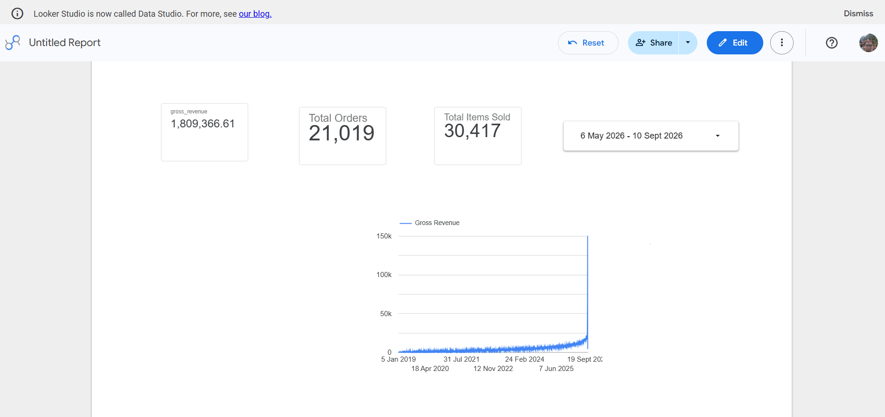
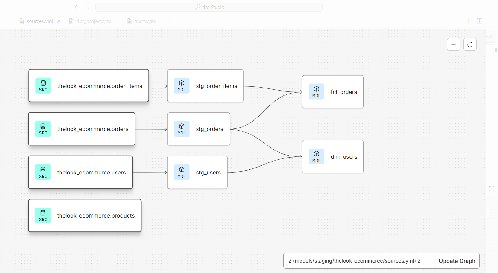

# E-commerce Analytics Engineering Project (dbt + BigQuery)

## 📊 Project Dashboard Preview
<!-- Drop your Looker Studio dashboard screenshot right below this line -->

🔗 **[Click here to view the Live Interactive Dashboard](https://datastudio.google.com/s/mL7joqEJkrM)

## 🔄 Data Lineage Graph (DAG)
<!-- Drop your dbt Lineage graph screenshot right below this line -->

## Project Overview
This project builds a scalable, production-ready data transformation pipeline for an e-commerce platform using **dbt v2** and **Google BigQuery**. It transforms raw transactional data into clean, business-ready dimensions and facts based on the Kimball dimensional modeling methodology.

## Architecture & Folder Structure
The project follows analytics engineering best practices by isolating layers:
- **Staging Layer (`models/staging/`)**: Ingests raw BigQuery tables (`users`, `orders`, `order_items`), applies clean casting, renames fields for consistency, and enforces primary key testing.
- **Marts Layer (`models/marts/`)**: Builds the presentation layer for BI tools.
  - `dim_users`: Consolidates customer profiles with behavioral aggregation (e.g., total orders, first/last purchase timestamps).
  - `fct_orders`: Computes transactional metrics like gross revenue and item counts, strictly avoiding fan-out issues.

## Data Quality & Testing
Data integrity is enforced at every layer using dbt tests:
- **Primary Keys**: Validated using `unique` and `not_null` tests.
- **Referential Integrity**: Enforced using `relationships` tests under the new dbt v2 `arguments` configuration to ensure zero orphaned transactions.

## Automated Orchestration
- Production environment deploys on the **`main`** branch using a cloud scheduler.
- Runs daily via automated **`dbt build`** jobs to seamlessly refresh BigQuery data warehouses (`dbt_mayad_prod`).
